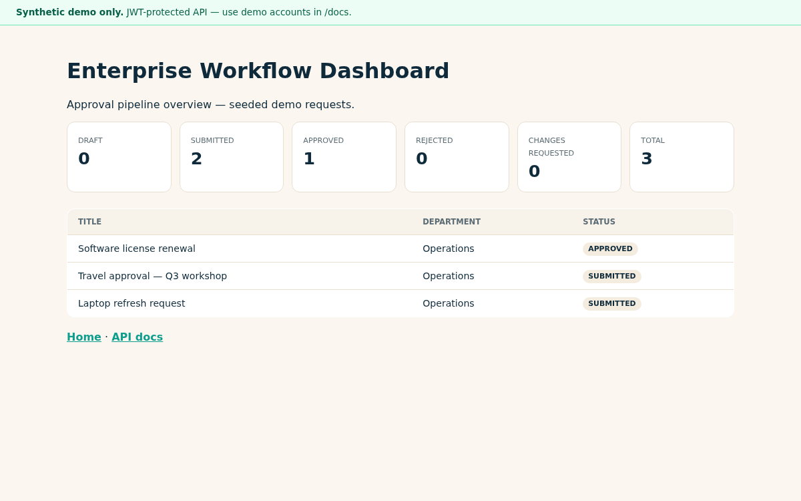

# Enterprise Workflow Management System

Generic enterprise workflow demo with JWT auth, RBAC, approval transitions, audit logs, dashboard counts, and CSV export. **Synthetic demo only** — no employer-specific data.

[](https://github.com/dawit-Tegegnwork/enterprise-workflow-management-system/actions/workflows/test.yml)

**Requirements:** Python 3.12+

This is a **production-style portfolio project** using **synthetic data only**. It demonstrates JWT auth, RBAC workflows, audit trails, and deployment patterns expected in enterprise backend systems — not an employer production deployment.

## Live Demo

| Channel | URL |
|---------|-----|
| **Cloud live demo** | https://enterprise-workflow-management-system.onrender.com/dashboard (free tier — cold start ~30s) |
| **API docs** | https://enterprise-workflow-management-system.onrender.com/docs |
| **Local** | `http://127.0.0.1:8001` after `docker compose up --build` |

## Quick Test in 3 Minutes

```bash
docker compose up --build
curl http://localhost:8001/health
```

1. Open http://localhost:8001/ — landing page  
2. Login at `/docs` as `staff@demo.local` / `Demo123!`  
3. `GET /api/v1/requests` — seeded workflow requests  
4. Login as `manager@demo.local` and approve a submitted request  

## Production-Style Features

- JWT authentication and RBAC (admin, manager, staff, auditor)  
- Workflow state machine with status history  
- CSV export and audit log APIs  
- `/health` and `/` landing page  
- Auto-seed demo users and requests  
- Docker Compose + CI  

## Health Check

```bash
curl http://localhost:8001/health
# {"status":"ok"}
```

## Synthetic Data Notice

All users, requests, and audit events are **synthetic demo data**. No employer-specific or production workflow information is included.

## What Recruiters Can Evaluate

- Role-based API authorization  
- Approval workflow design  
- Audit trail and reporting export  
- Production-style FastAPI project structure  

## Demo scenario (3–5 minutes)

1. `docker compose up --build` — demo users and 3 workflow requests auto-seed
2. Login as `staff@demo.local` / `Demo123!` at `/docs`
3. `GET /api/v1/requests` — inspect seeded requests
4. Login as `manager@demo.local` — approve a submitted request
5. `GET /api/v1/requests/export.csv` with manager token

## Screenshot



## Demo accounts

| Email | Password | Role |
|-------|----------|------|
| admin@demo.local | Demo123! | admin |
| manager@demo.local | Demo123! | manager |
| staff@demo.local | Demo123! | staff |
| auditor@demo.local | Demo123! | auditor |

## Run locally

```bash
python -m venv venv && source venv/bin/activate
pip install -r requirements.txt
cd backend && uvicorn app.main:app --reload --port 8001
```

Open http://127.0.0.1:8001/docs

## Docker Compose

```bash
docker compose up --build
```

## Tests

```bash
pytest -q
```

## Try live / Run locally

| | |
|---|---|
| **Live demo** | https://enterprise-workflow-management-system.onrender.com/dashboard |
| **Local** | `docker compose up --build` → http://127.0.0.1:8001/dashboard |

## This project demonstrates

Full-stack backend patterns for enterprise workflows: RBAC, JWT auth, status transitions, audit trail, reporting export, PostgreSQL-ready deployment.

## Docs

- [docs/data-model.md](docs/data-model.md)
- [docs/workflow-state-diagram.md](docs/workflow-state-diagram.md)
- [docs/rbac-matrix.md](docs/rbac-matrix.md)
- [docs/api-examples.md](docs/api-examples.md)
