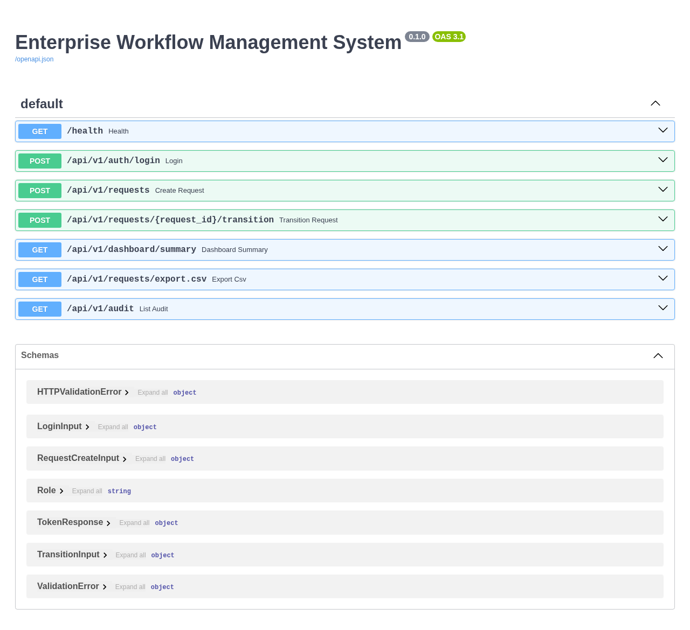

# Enterprise Workflow Management System

Generic enterprise workflow demo with JWT auth, RBAC, approval transitions, audit logs, dashboard counts, and CSV export. **Synthetic demo only** — no employer-specific data.

[](https://github.com/dawit-Tegegnwork/enterprise-workflow-management-system/actions/workflows/test.yml)

**Requirements:** Python 3.12+

## Demo scenario (3–5 minutes)

1. `docker compose up --build` — demo users and 3 workflow requests auto-seed
2. Login as `staff@demo.local` / `Demo123!` at `/docs`
3. `GET /api/v1/requests` — inspect seeded requests
4. Login as `manager@demo.local` — approve a submitted request
5. `GET /api/v1/requests/export.csv` with manager token

## Screenshot



## Demo accounts

| Email | Password | Role |
|-------|----------|------|
| admin@demo.local | Demo123! | admin |
| manager@demo.local | Demo123! | manager |
| staff@demo.local | Demo123! | staff |
| auditor@demo.local | Demo123! | auditor |

## Run locally

```bash
python -m venv venv && source venv/bin/activate
pip install -r requirements.txt
cd backend && uvicorn app.main:app --reload --port 8001
```

Open http://127.0.0.1:8001/docs

## Docker Compose

```bash
docker compose up --build
```

## Tests

```bash
pytest -q
```

## Try live / Run locally

| | |
|---|---|
| **Live demo** | [Deploy to Render](docs/RENDER_DEPLOY.md) (free tier) |
| **Local** | `docker compose up --build` → http://127.0.0.1:8001/docs |

## This project demonstrates

Full-stack backend patterns for enterprise workflows: RBAC, JWT auth, status transitions, audit trail, reporting export, PostgreSQL-ready deployment.

## Docs

- [docs/data-model.md](docs/data-model.md)
- [docs/workflow-state-diagram.md](docs/workflow-state-diagram.md)
- [docs/rbac-matrix.md](docs/rbac-matrix.md)
- [docs/api-examples.md](docs/api-examples.md)
