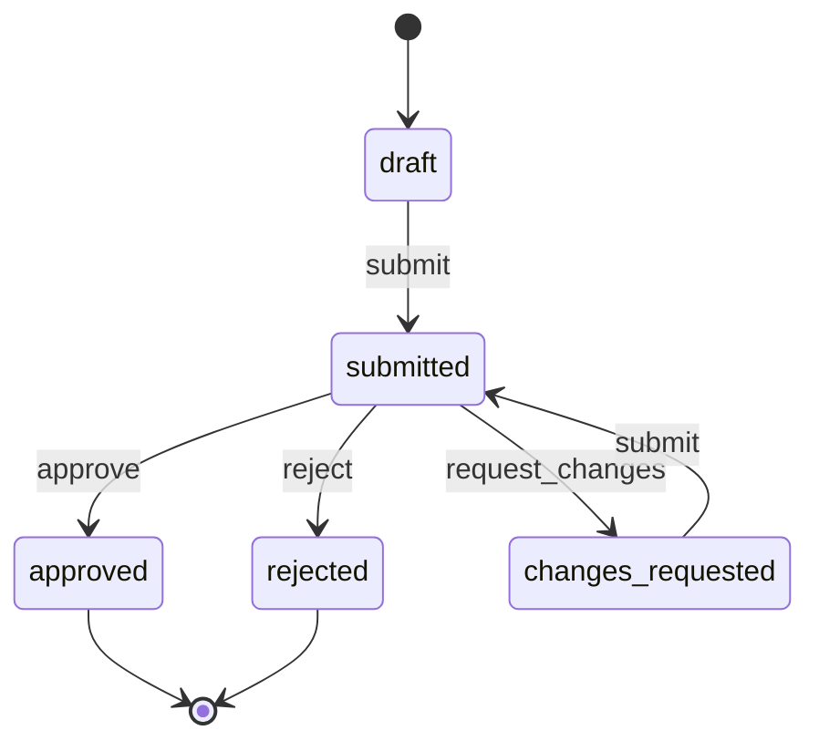

# Workflow state diagram

```mermaid
stateDiagram-v2
  [*] --> draft
  draft --> submitted: submit
  submitted --> approved: approve
  submitted --> rejected: reject
  submitted --> changes_requested: request_changes
  changes_requested --> submitted: submit
  approved --> [*]
  rejected --> [*]
```
